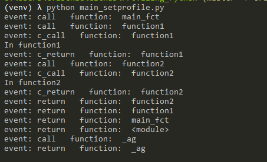
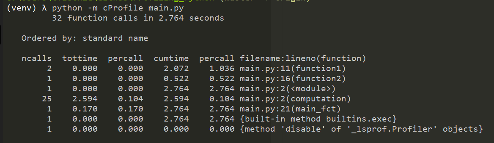
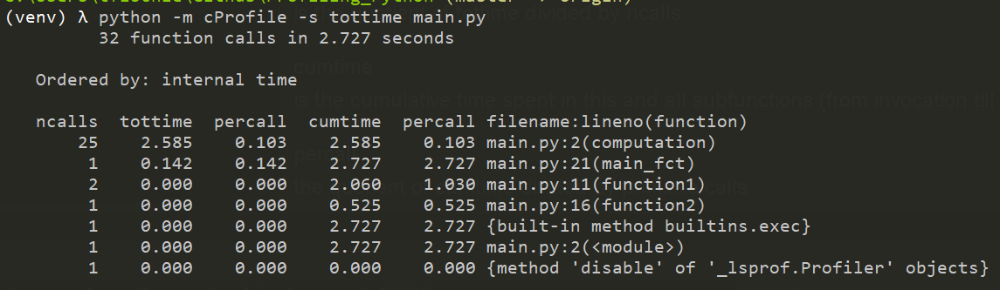
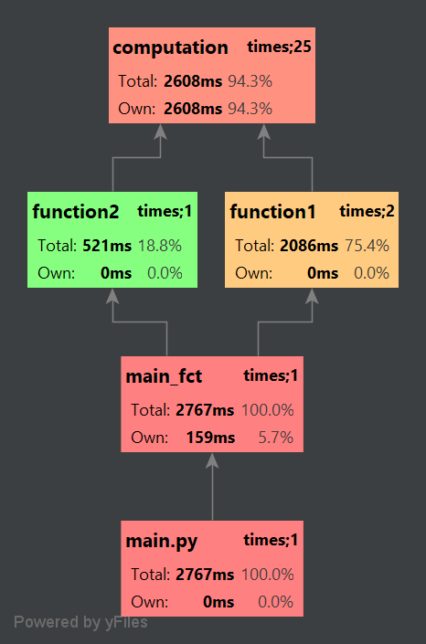
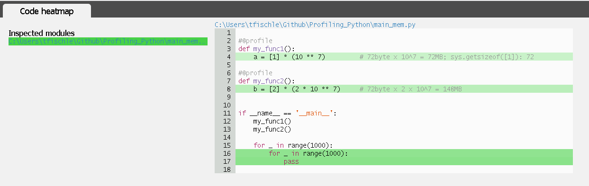
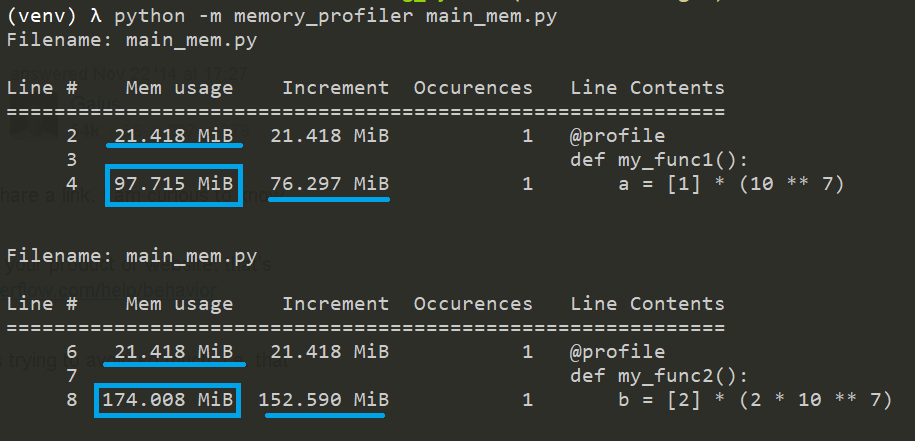
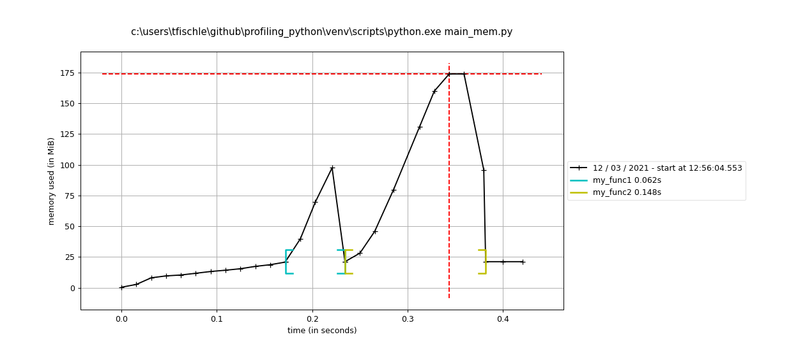

# Profiling Python
* Optimization: runtime or memory 
* Finding bottlenecks
* Where does the code spend most of the execution time?
 
## Deterministic Profiling
All function call, function return, and exception events are monitored, and precise timings are made
for the intervals between these events (during which time the user’s code is executing).

### How does profiling work? 
#### Python
In module sys, function ````setprofile()```` (https://docs.python.org/3/library/sys.html#sys.setprofile) <br/>
* called with events 'call' and 'return' <br/>




Similar there is a function ````settrace()```` (https://docs.python.org/3/library/sys.html#sys.settrace) <br/>
eg. https://github.com/nvdv/vprof/blob/8898b528b4a6bea6384a2b5dbe8f38b03a47bfda/vprof/code_heatmap.py#L46


#### cPython (C)
https://github.com/python/cpython/blob/master/Lib/cProfile.py

https://github.com/python/cpython/blob/master/Modules/_lsprof.c, search for "_PyEval_SetProfile"

Python/C API Reference Manual - 8.2 Profiling and Tracing <br/>
https://users.cs.duke.edu/~raw/Python/api/profiling.html


### Running as module
https://docs.python.org/3.7/library/profile.html
* cProfile is recommended for most users; it’s a C extension
* profile which is pure python and adds significant overhead
* can be run as module (-m) or as function

    
    python -m cProfile main.py



ncalls <br/>
the number of calls.

tottime <br/>
the total time spent in the given function (and excluding time made in calls to sub-functions)

percall<br/>
is the quotient of tottime divided by ncalls
    
cumtime<br/>
is the cumulative time spent in this and all subfunctions (from invocation till exit).

percall<br/>
the quotient of cumtime divided by primitive calls

Output can be sorted, e.g. by total time

    python -m cProfile -s tottime main.py



### PyCharm
* Needs PyCharm Professional
* Plots useful call <br/><br/>

[source code example call graph](main.py)<br/><br/>


### vprof
https://github.com/nvdv/vprof
* code heatmap (time spent per line)
* memory profiling
* flame graph
* starts http server



    vprof -c h main_mem.py

Remarks:
* slow
* memory graph not displayed completely (wrong?)


## Memory usage
### mprof
Memory increase by line:
````python -m memory_profiler main_mem.py````


https://github.com/pythonprofilers/memory_profiler
* uses psutil module
* @profile decorator

* created with <br/>
````mprof run --interval 0.001 main_mem.py````
````mprof plot````




## Statictical Profiling
# py-spy 
https://pypi.org/project/py-spy/
* works by sampling the execution state and examining the program counter
* determine which function was executing at the time of the sample
* less overhead
* provides only relative indications of where time is being spent

# Other tools
### gprof2dot
* Open source
* needs Graphiz
* https://github.com/jrfonseca/gprof2dot
https://medium.com/@antoniomdk1/hpc-with-python-part-1-profiling-1dda4d172cdf

1. First of all, we need to tell the profiler to dump the collected data into a file:

````python3 -m cProfile -o output.pstats script.py````

2. Secondly, we run gprof2dot to generate a png image:

````gprof2dot -f pstats output.pstats | dot -Tpng -o output.png````
    

### pympler
Detailed information about size and lifetime of Python objects
https://pympler.readthedocs.io/en/latest/index.html#
    
